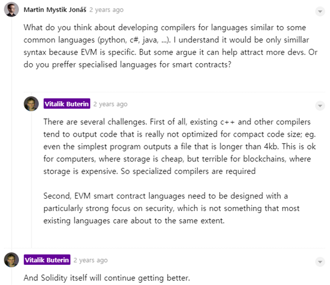

<h1>범용 언어와 다르게 Solidity가 가진 특징</h1>

2019 한국전자통신연구원
하계연수생 김승수
nablekim94@gmail.com
(2019년 08월 07일 작성)

<br><br><br><br>

>## Introduction

Solidity는 Smart Contract를 작성하는 언어로 본 글에서는 Solidity가 만들어지게 된 배경을 시작으로 기존 범용 언어와 다르게 갖고 있는 특징들을 설명하고자 한다. 눈에 띄는 특징들을 열거 및 설명하고 Solidity가 지원하지 않거나 지원하려고 노력하는 사항에 대해 언급한다.

<br><br><br>

>## Why do we need Solidity!?

***왜 Smart Contract를 기존 언어로 개발할 생각을 안하고 Solidity라는 새로운 언어를 만들어야했을까?***

- 비탈릭 뷰테린이 말한 이유
  1.  **Compact Code Size에 최적화** 하도록 설계된 컴파일러가 필요했다.
  2. **보안** 에 중점을 둔 언어가 필요했다.

- C++와 같은 기존 컴파일러들은 Output Code를 Compact Code Size에 최적화하도록 설계되지 않았다. 예를 들어, 가장 간단한 프로그램의 결과물도 4KB가 넘는다. 이러한 프로그램은 스토리지 비용이 저렴한 컴퓨터에는 별 문제가 되지 않지만, 스토리지 비용이 비싼 블록체인에게는 큰 문제가 된다. 그래서 특별한 컴파일러가 필요했다.

- [이미지 출처][1]


<br><br><br>

>## Characteristics of Solidity Language
[TOC]
<br>

### 변수와 데이터 타입

#### 변수의 종류
  ```solidity
  contract Sample {
    // 상태변수
    uint a;
    uint[] myArray = [0, 0];
    string myString = "Solidity";

    // 함수 매개변수와 리턴값
    function func(uint inputValue) public returns (uint returnValue) {
      // 함수 내 로컬 변수
      uint localVariable=0;

      for(int i=0; i<inputValue; i++)
        localVariable++;

      returnValue = localVariable;
    }
  }
  ```
  1. **상태변수**
      - Contract의 최상위단에 선언된 변수
      - 어떤 함수에 속한 변수가 아닌 **컨트랙트에 속한 변수**
      (마치 클래스의 멤버 변수와 유사)
      - 상태 변수에 대한 가시성 한정자
        - 상태 변수의 가시성 한정자 기본값은 internal임
        - 상태 변수의 가시성 한정자가 public이면 getter 함수가 자동 생성됨
        - 상태 변수는 external 가시성 한정자를 가질 수 없음
        - 상속 관계가 아닌 외부 컨트랙트에서는 가시성 한정자와 상관없이 상태 변수를 직접 접근할 수 없음
        ```solidity
        contract Sample {
          // 상태변수
          uint external x1; // Error
          uint public x2;
          uint internal x3;
          uint private x4;
        }

        contract Caller {
          function func() public {
            Sample s = new Sample();
            s.x1 = 10;  // Error
            s.x2 = 10;  // Error
            s.x3 = 10;  // Error
            s.x4 = 10;  // Error  
          }
        }
        ```

  2. **로컬변수**
      - 함수 내에 선언된 변수

  3. **매개변수, 리턴값**
      - 함수에 전달되는 파라미터 변수와 함수 실행 결과 반환되는 변수
<br>


#### 데이터 타입의 구분
  1. 기본 타입 (Basic Types) - Boolean, Integers, Fixed Point Number, Address 등
      - **Address**
        - 세부적으로 나누면 address와 address payable 타입으로 구분됨. (거의 똑같음)
          - 20bytes 이더리움 주소 값(0xaDc7192A0…)을 저장
          - **address payable은** address와 달리 **transfer()와 send()라는 멤버를 가져 Ether를 송금받을 수 있음.**
          - address는 주소를 저장하는 plain한 자료형임.
          - address payable과 address 사이 형변환 가능.
        - <=, <, ==, !=, >= and > 연산자 사용 가능
        <br>
        - Address가 갖는 멤버
          1. balance
              - 주소의 잔액 조회
              - wei 단위로 표현

          2. transfer
              - Ether를 Wei 단위로 주소에 보냄
              - 오류 발생 시 **예외를 발생** 시키고 모든 변경을 되돌림
              - 2300 gas 소모
              - send보다 **transfer 사용을 권장**
              *<span style="color:red">why? 오류 이벤트에서 예외를 스택의 위쪽으로 올리고 수행을 중단시키기 때문</span>*
              ```solidity
              address x = 0x123...;
              address myAddress = this;
              if (x.balance < 10 && myAddress.balance >= 10)
                x.transfer(10);
              ```

          3. send
              - transfer와 유사하게 계정 주소에 이더를 전송
              - 2300 gas 소모
              (이더 송금에 이 정도의 가스면 충분)
              - 실행 결과 true or false를 반환
              - 실패 시, 걸어두었던 gas가 반환 X, 예외 발생 X

          4. call
              - ABI를 사용하지 않고 계약 내의 어떠한 함수든 호출할 수 있음
              - <span style="color:red">때로는 계약의 인터페이스(ABI)를 사용할 수 없어 call 메서드를 사용하는 것만이 함수를 호출하는 유일한 방법인 경우가 있음</span>
              - call을 통한 호출은 컴파일 시 검사가 없으며 true or false 값을 반환
              ```solidity
                /*
                 * 계약 내 모든 함수는 4바이트 식별자를 사용해 실행시간에 식별
                 * 이때, 4바이트 식별자는 '함수명+파라미터' 타입을 해싱 후 첫 4바이트를 말함
                 * call 함수는 함수를 호출할때 첫번째 파라미터로 '함수식별자', 이후엔 파라미터를 전달
                */
                myaddr.call(bytes4(sha3("SetBalance()")));
                myaddr.call(bytes4(sha3("SetBalance()")), 10);
              ```
              <br>

              - ex) UsingCall 컨트랙트에서 EtherBox의 SetBalance()함수를 호출하는 예시

              ```solidity
              pragma solidity ^0.4.17;

              contract EtherBox {
                  uint balance;

                  function SetBalance() public payable{
                      balance = balance + 10;
                  }

                  function GetBalance() public payable returns (uint) {
                      return balance;
                  }
              }

              contract UsingCall {

                  // 컨트랙트 배포 시 이더를 같이 보내서 컨트랙트 계정에 돈이 있도록 함
                  function UsingCall() public payable {
                  }

                  function SimpleCall() public returns (bool, uint) {
                      bool status = true;
                      EtherBox eb = new EtherBox();
                      address myaddr = address(eb);
                      status = myaddr.call(bytes4(sha3("SetBalance()")));
                      return (status, eb.GetBalance());
                  }

                  function SimpleCallwithGas() public returns (bool) {
                      bool status = true;
                      EtherBox eb = new EtherBox();
                      address myaddr = address(eb);

                      // 함수 호출 시, Gas를 함께 보냄
                      status = myaddr.call.gas(200000)(bytes4(sha3("SetBalance()")));
                      return status;
                  }

                  function SimpleCallwithGasAndValue() public returns (bool) {
                      bool status = true;
                      EtherBox eb = new EtherBox();
                      address myaddr = address(eb);

                      // 함수 호출 시, Gas와 Ether(Wei 단위)를 함께 보냄
                      status = myaddr.call.gas(200000).value(1)(bytes4(sha3("SetBalance()")));
                      return status;
                  }
              }
              ```

          5. delegatecall
              - 다른 컨트랙트에 저장된 라이브러리 코드를 사용하기 위함
              - 저장소, 잔고 등은 **현재 컨트랙트를** 사용하고 다른 컨트랙트에서는 오직 라이브러리 코드만 사용
              (call, delegatecall, callcode는 Solidity의 타입 안전성을 깨뜨리므로 최후의 수단으로 사용)

      - **고정 소수점**
        - ufixedMxN, fixedMxN로 표현
          - M은 타입에 의해 취해진 비트 수로 8~256비트 사이의 값
          - N은 소수점이하 자리수를 의미하며 0~80 사이값을 가져야 함
        - 고정 소수점 수는 아직 solidity에서 완벽하게 지원되지 않음
        - 고정 소수점 수는 **선언될 수는 있지만 할당될 수는 없음**
          - ***why?
            수를 정확히 다룰 수 없는 타입은 이더(Ether)를 다룰 수 없어, 솔리디티는 부동소수점을 지원하지 않습니다.***
        

      - **int/uint**
        - 다양한 크기의 부호있는 및 부호없는 정수
        - **크기를 명시할 수 있음**
        ex) uint8~uint256, int8~int256 (단위 비트)
        - 음수를 오른쪽 시프트연산하는 경우 타 언어와 다르게 0으로 반올림되어 감(절사)
          - [공식 홈페이지 글 인용][3] : *부호있는 음의 정수를 우측 시프트 연산 한 결과값은 다른 프로그래밍 언어에서의 결과값과 다릅니다. solidity에서는, 우측 시프트는 나눗셈과 매핑되며 그로 인해 시프트된 음의 값은 0으로 반올림되어 갑니다(절사). 다른 프로그래밍 언어에서는, 음의 값을 우측 시프트연산 하는 경우, 나눗셈과 소수점 이하 버림이 동시에 작동하는것과 유사하게 동작합니다(음의 무한대 방향).*


  2. 복합 데이터 타입 (Complex Types) - 고정 크기 바이트 배열, 동적 크기 바이트 배열, Array, Struct, Mapping
      - **고정 크기 바이트 배열**
        - bytes1~bytes32 크기 제한 가능(byte == bytes1)
        - X[i] : i번째 바이트를 읽을 수 있음
        - .length 멤버를 가져 바이트 배열의 고정된 길이를 반환

      - **동적 크기 바이트 배열(bytes & string)**
        - 임의 길이의 원시 바이트 데이터의 경우, bytes 사용
        - UTF-8 인코딩 임의 길이의 문자열 데이터일 경우, string 사용
        - string의 경우, 특정 순서의 바이트를 읽으려면 bytes형으로 변환해야 함
        ex) bytes(s).length;  // s가 string 타입
        ex) bytes(s)\[7]='x';
        - **문자열을 비교하는 함수가 내장되어 있지 않아** keccak256을 이용해서 해쉬값을 비교해야함
        ```solidity
        function nameCompare(string name1, string name2) public returns (bool) {
          return (keccak256(name1) == keccak256(name2));
        }
        ```

      - **Array**
        - 컴파일 타임 고정 크기를 가질 수도 있고 동적인 크기를 가질 수 있음
        - 스토리지 배열의 경우, 요소의 타입은 임의적임
        (즉, 다른 배열이 될 수도 있고, 매핑이나 구조체일수도 있음)
        - 메모리 배열의 경우, 요소의 타입은 매핑일 수 없고 함수의 인자라면 ABI 타입이어야 함
        - **동적 배열 선언 시, 다른 언어와 달리 표기법이 반대.** 접근 방법은 타언어와 동일
        ex) 5개의 동적 배열 uint는 uint[]\[5]로 선언
        - .length, .push(), .pop() 멤버를 가짐
        (push는 배열 끝에 추가, pop은 배열 끝 원소 하나를 제거)

      - **Mapping**
        - **키로 값을 참조할 수 있는 집합 형태(해쉬 테이블)**
        - 상태변수 또는 내부 함수에서의 Storage 참조 타입에만 사용 가능
        - key-value 쌍을 저장
        ex) mapping( \_KeyType => \_ValueType)
          - \_KeyType : 매핑, 동적 크기 배열, 컨트랙트, 열거형, 구조체를 제외한 타입
          - \_ValueType : 모든 타입 가능
        - 타 언어의 해시 테이블 또는 딕셔너리와 유사(python)        
        - Key 데이터는 keccak256 해시값으로 변경되어 사용됨
        - Solidity에서는 Mapping에 대해 **직접적으로 Iteration이 불가** = Mapping에 저장된 모든 목록을 얻는 기능이 X => So, [Iteration 기능은 직접 구현해야 함.][2]
        (이더리움에서 Iteration과 Looping은 가스 비용이 많이 드는 연산이기 때문)

        ```solidity
        pragma solidity ^0.4.0;

        contract MappingExample {
            mapping(address => uint) public balances;

            function update(uint newBalance) public {
                balances[msg.sender] = newBalance;
            }
        }

        contract MappingUser {
            function f() public returns (uint) {
                MappingExample m = new MappingExample();
                m.update(100);
                return m.balances(this);  // 100 return
            }
        }
        ```


<br><br>


### 데이터 위치

#### 변수의 종류별 기본 저장 위치
  - Contract 내에서 선언 및 사용되는 각각의 변수에는 **데이터 위치** 가 있음.
  - **리턴 변수의 기본값은 메모리** 이고 **상태 변수의 기본값은 스토리지** 임.
  - **함수의 매개변수는 기본적으로 메모리 영역** 에 저장되나 외부 함수의 매개변수는 Calldata에 저장됨.
  - **함수 내 로컬 변수**는 **값 타입의 경우 Memory**, **복합 데이터 타입의 경우 Storage** 가 기본 데이터 위치임.
  (단, 복합 데이터 타입 변수의 경우 지시어를 사용하여 강제로 Memory 위치에 저장할 수 있음)
  - 리터럴의 경우, 상태 변수 영역에서 쓰이면 Storage에 저장되고 함수 내에서 쓰이면 Memory에 저장됨.

  |데이터 위치|설명|
  |----|-----------------------|
  |Storage|컨트랙트 내의 모든 함수가 사용할 수 있음 <br>이더리움 네트워크 내의 모든 노드에 **영구적으로 저장** 됨 <br>HardDisk와 같은 **File System에 저장됨** |
  |Memory|함수 내에서 사용할 수 있음 <br>함수가 실행을 마칠 때 사라지는 **단기 휘발성 메모리** |
  |Calldata|모든 입력 **함수의 인자와 실행 데이터를 저장** 하는 곳<br>함수 인자가 저장되고 수정 불가능하며 지속성이 없는 calldata라는 데이터 위치가 존재<br>외부 함수의 매개 변수는 calldata에 강제 저장되며 **memory처럼 작동** |
  |Stack|변수의 적재와 이더리움 인스트럭션 세트를 가지고 작업하는 중간값을 저장하기 위해 스택을 유지<br>EVM의 작업 세트 메모리<br>EVM의 스택 깊이는 1024단계 >> 그 이상을 저장하면 예외 발생|


<br><br>
  - 복합 데이터 타입도 기본적으로 위의 룰을 따르나 지시어(storage, memory)를 사용하여 저장 위치를 지정할 수 있음.

  ```solidity
  // 함수 내 복합 데이터 타입의 로컬변수가 memory 위치에 저장
  contract Sample{
    function func1() {
      uint24[3] memory myArray3= [1, 2, 99999];
    }
  }
  ```
<br><br>

  - 리터럴의 경우, 상태 변수 자리에 나타나면 스토리지에 저장되고 함수 내부에 나타나면 메모리에 저장됨.

  ```solidity
  // 선언되는 위치에 따라 저장되는 위치가 다른 리터럴 예제
  contract Sample{
    uint24[3] myArray3= [1, 2, 99999];  // 이 배열 리터럴은 스토리지에 저장
    function func2() {
      uint24[3] memory myArray4= [1, 2, 99999]; // 이 배열 리터럴은 메모리에 저장
    }
  }
  ```

<br><br>

#### 변수의 데이터 위치를 정하는 규칙

  **변수 선언 위치(상태/로컬/파라미터/리턴)** 과 **변수의 자료형(기본/복합)** 에 따라 변수의 데이터 위치가 결정된다.

  
  [이미지출처][9]

  <br>

  1. **상태 변수는 항상 스토리지에 저장** 되는데, 상태 변수간의 대입은 항상 복사본을 생성하여 대입됩니다. (복합 데이터 타입이든 값 타입이든 동일하게 복사본이 생성됨)
  ```solidity
  pragma solidity ^0.5.0;  

  contract Locations {  

    uint public stateVar1 = 10;  
    uint stateVar2 = 20;  

    function doSomething() public returns (uint) {  

     stateVar1 = stateVar2;  
     stateVar2 = 30;  

     return stateVar1; //returns 20  
    }  
  }  
  ```
  <br>

  ```solidity
  pragma solidity ^ 0.5.0;  

  contract Locations {  

    uint[3] stateVar = [1, 2, 30];
    uint[3] stateVar2;
      function doSomething() public returns (uint){

          stateVar2 = stateVar;
          stateVar[1] = 20;

          return stateVar2[1];   // 2 return

      }  
  }  
  ```
  <br>

  2. **스토리지** 에 저장된 **기본 타입 변수** 와 **메모리** 에 저장된 **기본 타입 변수** 간의 대입은 복사본이 생성되어 대입됩니다.
  ```solidity
  pragma solidity ^ 0.5.0;

  contract Locations {

      uint stateVar = 10; //storage

      function doSomething() public returns(uint) {

          uint localVar = 20; //memory    
          stateVar = localVar;  
          localVar = 40;

          return stateVar; //returns 20    
      }  
  }  
  ```
  <br>

  3. **기본 타입의 로컬 변수 간** 대입은 복사본이 생성되어 대입됩니다.
  ```solidity
  pragma solidity ^ 0.5.0;  

  contract Locations {  
    function doSomething() public returns (uint) {

         uint localVar1=10;
         uint localVar2;
         localVar2=localVar1;
         localVar1=50;

         return localVar2;   // 10 return
    }  
  }
  ```
  <br>

  4. **스토리지에 저장된 복합 데이터 타입의 로컬 변수** 를 **복합 데이터 타입의 상태변수에 대입** 하는 경우, 포인터가 복사된다.
  ```solidity
  pragma solidity ^0.4.26;  

   contract Locations {  

     uint[3] stateVar;

     function doSomething() public returns (uint){
         uint[3] storage localVar;

         localVar[0]=1;
         localVar[1]=2;
         localVar[2]=30;

         stateVar = localVar;
         localVar[1]=20;

         return stateVar[1];   // 20 return
     }  
  }
  ```
  <br>

  5. **스토리지에 저장된 복합 데이터 타입의 로컬 변수** 를 **스토리지에 저장된 복합 데이터 타입의 로컬변수** 에 대입하는 경우, 포인터가 복사된다.
  ```solidity
  pragma solidity ^ 0.5.0;  

  contract Locations {  

    uint[3] stateVar=[1, 2, 30];
    function doSomething() public returns (uint){

        uint[3] storage localVar=stateVar; // copy
        stateVar[1]=20;

        return localVar[1];   // 20 return
    }  
  }
  ```
  <br>

  6. **스토리지에 저장된 복합 데이터 타입의 로컬 변수** 를 **메모리에 저장된 복합 데이터 타입의 로컬변수** 에 대입하는 경우, 복사본이 생성되어 대입됩니다.
  ```solidity
  pragma solidity ^0.4.26;  

  contract Locations {  

    function doSomething() public returns (uint){
        uint8[3] storage localVar;
        localVar[0]=1;
        localVar[1]=2;
        localVar[2]=30;

        uint8[3] memory localVar2;

        localVar2 = localVar;
        localVar[1]=20;

        return localVar2[1];   // 2 return
    }  
  }
  ```
  <br>

  7. **메모리** 에 저장되어 있는 **복합 데이터 타입** 을 **메모리** 에 있는 **다른 복합 데이터 타입 변수** 에 대입할 때는 복사본이 만들어지 않습니다. 한마디로, 포인터가 복사된다.
  ```solidity
  pragma solidity ^ 0.5.0;

  contract Locations {  

      function doSomething()
          public pure returns(uint[] memory, uint[] memory) {

          uint[] memory localMemoryArray1 = new uint[](3);  
          localMemoryArray1[0] = 4;  
          localMemoryArray1[1] = 5;  
          localMemoryArray1[2] = 6;

          uint[] memory localMemoryArray2 = localMemoryArray1;  
          localMemoryArray1[0] = 10;

          return (localMemoryArray1, localMemoryArray2);
         //returns 10,4,6 | 10,4,6    
      }  
  }
  ```
  <br>

  8. **메모리** 에 저장된 **복합 데이터 타입** 의 값을 **스토리지** 에 저장된 **복합 데이터 타입** 의 **로컬 변수** 에 대입할 수 없습니다. 상태 변수로의 대입은 가능.
  ```solidity
  // 함수 내 복합 데이터 타입의 로컬변수가 Storage 위치에 저장되어 있는데
  // Memory 위치에 저장된 [1, 2, 99999] 배열 리터럴을 대입하려해서 에러 발생
  contract Sample{
    function func1() {
      uint24[3] myArray3= [1, 2, 99999];  // 컴파일 에러 발생
    }
  }
  ```
  <br>

  ```solidity
  pragma solidity ^0.4.26;  

  contract Locations {  

    uint8[3] stateVar;

    function doSomething() public returns (uint){
        uint8[3] memory localVar= [1, 2, 30];

        stateVar = localVar;
        localVar[1]=20;

        return stateVar[1];   // 2 return
    }  
  }
  ```
  <br>

  9. **메모리** 에 저장된 **값 타입** 의 값을 **메모리** 에 저장된 **값 타입** 변수에 대입할 때는 복사본이 생성되어 대입됩니다.
  ```solidity
  pragma solidity ^ 0.5.0;  

  contract Locations {  

      function doSomething() public pure returns(uint) {

          uint localVar1 = 10; //memory    
          uint localVar2 = 20; //memory

          localVar1 = localVar2;  
          localVar2 = 40;

          return localVar1; //returns 20    
      }  
  }  
  ```
  <br>

  10. **복합 데이터 타입의 상태 변수** 를 **Storage에 저장된 복합 데이터 타입의 로컬 변수** 에 대입하는 경우는 복사본이 생성되는 것이 아니라, 로컬 변수가 상태 변수의 **포인터** 가 됩니다. 따라서 로컬 변수를 이용하여 값을 변경하면, 상태 변수의 값도 변경되는 것이죠.
  ```solidity
  pragma solidity ^ 0.5.0;  

  contract Locations {  

    uint[3] stateVar = [1, 2, 30];
    function doSomething() public returns (uint){

        uint[3] storage localVar = stateVar; // pointer
        stateVar[1] = 20;

        return localVar[1];   // 20 return

    }  
  }  
  ```
  <br>

  11. **복합 데이터 타입의 상태 변수** 를 **Memory에 저장된 복합 데이터 타입의 로컬 변수** 에 대입하는 경우는 복사본이 생성되어 대입됩니다.
  ```solidity
  pragma solidity ^ 0.5.0;  

  contract Locations {  

    uint[3] stateVar = [1, 2, 30];
    function doSomething() public returns (uint){

        uint[3] memory localVar = stateVar; // copy
        stateVar[1] = 20;

        return localVar[1];   // 2 return

    }  
  }  
  ```

<br><br>


### 함수

#### 함수란?
  - **상태 변수를 읽거나 상태 변수에 값을 쓰는 메커니즘**
  - 호출을 통해 실행할 수 있는 코드의 단위
  (컨트랙트 내의 함수를 호출하면 그 결과로 트랜잭션이 생성됨)

#### Solidity에서 지원하는 함수의 특징
- 함수 선언 시 function 키워드, 함수명, 파라미터 나열들은 기존 다른 언어와 형태가 유사하나 그 외에도 **Modifier(수정자), Visibility(가시성) 한정자, 여러 개의 파라미터를 반환(튜플 이용)** 할 수 있음.
  cf. 튜플 : 여러 개의 변수로 구성된 맞춤 자료구조
- 람다 함수나 인라인 함수 역시 계획되어 있지만 아직 지원되지 않음

  1. **가시성(Visibility) 한정자**
      - 스마트 컨트랙트 내 상태변수들과 함수들의 **공개 범위** 를 결정
      - Java나 C++에서 제공하는 접근제어자(Access Control)와 유사한 역할을 함

      <br>

      |가시성 한정자|설명|
      |------|-------------|
      |public|내/외부에서 함수에 직접 접근이 가능|
      |internal|현재 컨트랙트 및 그것을 상속한 컨트랙트 안에서만 사용할 수 있음|
      |private|함수를 선언한 컨트랙트에서만 사용할 수 있음|
      |external|외부에서 직접적으로 접근이 가능하나 내부에서는 접근 불가<br>컨트랙트 인터페이스로 사용<br>상속 받은 컨트랙트에서도 접근 불가|

      

      ```solidity
      pragma solidity 0.4.16

      contract C {
        uint public data;

        function f(uint a) private pure returns (uint b) {
          return a+1;
        }

        function setData(uint a) interanl {
          data=a;
        }
      }
      ```
      <br>

  2. **상태 변경 가능성(state mutability) 속성**
      - 컨트랙트의 상태 변수를 변경하는 능력과 관련된 동작을 바꾸는 **추가적인 한정자**

      <br>

      |속성|설명|
      |---|--------------|
      |view|읽기전용. 현재 상태 변수를 읽고 반환할 수 있는 함수<br>블록체인의 상태를 수정할 수 없음|
      |pure| 상태 변수에 접근(읽고 쓰기)하지 못하며 단순히 연산만 수행하는 함수|
      |payable| 지불. 호출자로부터 이더를 받을 수 있는 함수<br>송금자가 이더를 제공할 때 사용<br>함수를 호출하며 이더리움을 전송 받을 수 있는 함수를 지정하기 위해 사용|

      ```solidity
      pragma solidity >=0.5.0 <0.7.0;

      contract C {
          uint n1;

          // view 예시
          function view_func(uint a, uint b) public view returns (uint) {
            return a * (b + 42) + n1;
          }

          // pure 예시
          function pure_func(uint a, uint b) public pure returns (uint) {
              return a * (b + 42);
          }

          // payable 예시
          function payable_func(param1... n ) public payable returns(param 1... n) {
             ......
          }
      }
      ```
      <br>


  3. **Fallback function**
      - 컨트랙트 내 **이름 없는 함수**
      - 컨트랙트 내에 단 하나만 가질 수 있음
      - 인자도 리턴 값도 가질 수 없음
      - 실행되는 경우
        - 어떤 컨트랙트의 함수를 호출하려고 할 때 **매칭되는 함수가 존재하지 않는 경우**
        - 트랜잭션이 컨트랙트에 이더를 송금했으나 메소드를 호출하지 않은 경우(fallback 함수가 없으면 컨트랙트로 이더를 받을 수 없음)
      - **external 가시성을 가져야하며 Payable로 설정** 되어야 함
      - 사용할 수 있는 가스 양이 2300으로 제한 >> fallback 함수는 주로 이더 수신 로깅을 하는데 사용

      ```solidity
      function() external payable {
         require(msg.data.length == 0); // 전송된 데이터가 비어있음 확인
         emit LogDepositReceived(msg.sender); // 이더 수신 기록
      }
      ```
        <br>


  4. 솔리디티에서 반환할 **변수 이름을 미리 지정** & **여러 개의 반환값** 을 가질 수 있음
      - 반환할 변수의 이름을 미리 지정할 수 있음.
      (이름 지정을 안해도 상관없음)
      ```solidity
      pragma solidity >=0.4.16 <0.7.0;

      contract Simple {
          function arithmetic(uint _a, uint _b) public pure returns (uint o_sum, uint o_product)
          {
              o_sum = _a + _b;
              o_product = _a * _b;
          }    
      }
      ```
      <br>


  5. 솔리디티에서 함수는 **여러 개의 반환값을** 가질 수 있음
      ```solidity
      // 복수개의 파라미터 반환
      function multipleOutgoingParameter(int _data) returns (int square, int half) {
      	square = _data * _data;
      	half = _data /2;
      }

      // 튜플을 이용하여 반환
      function multipleOutgoingParameter(int _data) returns (int square, int half) {
      	(square, half) = (_data * _data, _data /2);
      }

      function arithmetic(uint _a, uint _b) public  pure  returns (uint o_sum, uint o_product)
      {
          return (_a + _b, _a * _b);
      }
      ```


<br><br>

### Special Global Variables & Functions
- 전역 네임스페이스에는 특수한 변수와 함수가 존재
- 이들은 블록체인에 관한 정보를 제공
- msg.sender와 msg.value를 포함한 모든 msg의 멤버 값은 외부 함수 호출에 따라 바뀔 수 있음

#### 블록 및 트랜잭션 속성


<br>

#### 수학 및 암호화 함수


<br><br>

### Modifier(수정자)

#### Modifier란?
  - **어떤 함수를 실행시키기 전이나 실행시킨 후에 특정한 기능을 할 수 있도록(함수의 동작을 변경)** 만들기 위해 사용하는 것을 말함
<br>

#### Modifier의 특징
  - 유효성 검증이나 진위 확인을 위한 규칙으로 깔끔하게 함수를 작성하는 데 도움이 됨
  - 주로, **어떤 함수를 실행하기 전에 어떤 조건에 부합하는지 확인** 하는데 사용
  ex) A 함수를 실행시키기 전에, 함수 호출 계정이 스마트 컨트랙트를 배포한 사람의 계정과 동일한지 확인하는데 사용
  - 상속, Overriding 가능
<br>

#### Modifier 사용 방법
  - Modifier 작성 시, **\'\_\'(underscore)를 사용하는데 이는 함수의 내용을 실행하는 시점을** 나타냄
  - 아래의 예제로 설명하면, mortal 컨트랙트의 close()함수는 onlyOwner라는 Modifier가 설정되어 있다. close()함수가 호출될 때, modifier onlyOwner {} 안에 있는 내용이 먼저 실행되고 이후 \_(underscore)를 만났을 때 close() 함수의 내용이 실행된다.

  ```solidity
  pragma solidity ^0.4.21;

  contract owned {

      // 생성자를 통해 owner변수에 계약 최초 생성자의 주소를 저장합니다.
      function owned() public { owner = msg.sender; }
      address owner;

      // _; 라는 문법을 통해서 modifier를 사용하는 function의 body가 그대로 실행됩니다.
      // 아래의 modifier는 transaction을 발생시키는 주체가 계약의 최초 생성자(owner)가 아니면
      // exception을 발생시킵니다.
      modifier onlyOwner {
          require(msg.sender == owner);
          _;
      }

  }

  // 위에서 만든 contract를 상속받습니다.
  contract mortal is owned {

      // owned에서 정의된 modifier를 close 함수에 접목시킵니다.
      // 즉 그 얘기는 아래의 close함수는 owner에 의해서만 실행이 가능하다는 얘깁니다.
      function close() public onlyOwner {
          selfdestruct(owner); //이 함수는 계약을 파기시킵니다.
      }

  }
  ```

<br><br>


### Library(라이브러리)

#### Library란?
  - 특정 주소에 한번 배포되어 다양한 컨트랙트에서 **재사용하기 위한 코드**

<br>

#### Library의 특징
  - 계약 상태를 변경하기 위한 것이 아닌, 입력 및 반환 결과를 기반으로 **간단한 작업을 수행** 하는 데 사용
  - 컨트랙트와 유사하게 생겼으나 **상태 변수를 가질 수 없으며, 상속 및 이더 수신이 불가능함**
  - 사용자가 내부적으로 라이브러리를 사용하는 스마트 컨트랙트에 트랜잭션을 보낼 때(라이브러리 내 함수를 호출한 상황), 상태 변화는 라이브러리 컨트랙트에서 일어나는 것이 아닌 호출되는 스마트 컨트랙트에서 일어남 = 호출된 스마트 컨트랙트 상에서 상태 변화가 일어남.
  (EVM의 delegate call 기능 덕분)

  > cf. Delegate Call <br>
  “Delegatecall is **identical to a message call apart from the fact that the code at the target address is executed in the context of the calling contract and msg.sender and msg.value do not change their values.** <br>
  This means that **a contract can dynamically load code from a different address at runtime.** Storage, current address and balance still refer to the calling contract, only the code is taken from the called address.” <br>
  This low-level function has been very useful as it’s the backbone for implementing libraries.
  [출처][4]

<br>

#### Library 배포 방법
1. Embedded library
    - 스마트 컨트랙트가 오직 internal 함수들만 가진 라이브러리를 사용하는 경우, EVM은 라이브러리를 별도로 배포하는 것이 아니라 스마트 컨트랙트 내부에 단순히 내장한다. 다시 말하면, 라이브러리 내의 함수를 호출하기 위해 delegate call을 사용하는 대신에 일반 함수를 호출하듯 Jump statement를 사용함

2. Linked library
    - 라이브러리가 public 또는 external 함수들을 포함하는 경우, 라이브러리는 배포되어야 함
    - 블록체인 상에 배포하게 되면 고유의 주소(Unique Address)를 가질 것이고 이 주소를 호출하려는 스마트 컨트랙트(calling contract)와 연결해야 함

    ```solidity
    pragma solidity ^0.4.23;

    contract ERC20 {

        using SafeMath for uint256;
        mapping(address => uint256) balances;

        function transfer(address _to, uint256 _value) public returns (bool success) {
            balances[msg.sender] = balances[msg.sender].sub(_value);
            balances[_to] = balances[_to].add(_value);
            return true;
        }
    }

    library SafeMath {

        function mul(uint256 a, uint256 b) external pure returns (uint256) {
            uint256 c = a * b;
            assert(a == 0 || c / a == b);
            return c;
        }


        function div(uint256 a, uint256 b) external pure returns (uint256) {
            uint256 c = a / b;
            return c;
        }


        function sub(uint256 a, uint256 b) external pure returns (uint256) {
            assert(b <= a);
            return a - b;
        }


        function add(uint256 a, uint256 b) external pure returns (uint256) {
            uint256 c = a + b;
            assert(c >= a);
            return c;
        }
    }
    ```
<br>

#### 'Using for' in library
  - 'using X for Y'
    - **X의 라이브러리 함수들을 Y 타입에 Attached** 시킨다는 의미
    - 한 가지 예를 들어 보면, SafeMath 라이브러리의 function들이 uint256 타입에 bound 됨

    ```solidity
    using SafeMath for uint256;

    uint256 a = 10;
    uint256 b= 10;

    uint256 c = a.add(b); // SafeMath 라이브러리의 add()함수에 a, b가 파라미터로 전달될 것임
    ```
    - 라이브러리 함수를 사용할 때 주의해야할 점은 라이브러리 함수를 호출하는 객체(Object)를 그 함수의 첫 번째 파라미터로 받아야 한다는 사실이다.
    (One condition which should be taken care is, library functions will receive the object they are called on as their first parameter)

<br><br>


### 예외처리
  - 0.4.9 버전(메트로폴리스) 이전에는 예외를 구현하기 위해 잘못된 주소로 점프 방식을 사용하여 남은 가스를 모두 소모시키고 변경 사항은 실행 전 원래 상태로 복원되는 방식을 취했음
  - 0.4.11 버전부터 INVALID 명령어(0xfe)를 도입하면서 **시스템 내부 예외와 의도적 예외를 구분** 할 수 있게 되었고 **남은 가스를 다시 돌려주는 방식** 을 취했음
  - 솔리디티 4.10 이전에는 오류 처리를 위한 throw문 하나만 있었으나 이후에는 **assert, require, revert문** 이 새롭게 도입
  - but, **try-catch문과 같은 오류 및 예외를 잡아내는 구문이 없음**

<br>

#### 예외의 구분  
  1. 시스템 내부에서 발생한 예외
      - 가스 부족
      - 0으로 나누는 오류
      - 자료형 오버플로우 오류
      - 배열 인덱스 오류
      (주로 치명적 문제를 일으킬 소지가 있는 부분)

  2. 프로그래머가 정해놓은 의도적 예외
      - 사용자 입력값 & 권한 검증
      - 코드가 실행되는 사전 조건 불일치

<br>

#### 예외처리문 종류

  |목록|설명|
  |---|--------------|
  |require|함수를 실행하기 위한 선결조건을 선언할 때 사용<br>assert문과 달리 사용하지 않은 가스는 호출자에게 반환됨<br>외부로부터 들어온 값을 검증하는데 사용<br>내부적으로 REVERT 명령어(0xfd)를 사용|
  |assert|사용하지 않은 가스를 호출자에게 반환하지 않고 다 소모하고 상태는 원래대로 되돌림<br>함수의 현재 상태와 조건을 실행 전에 검증하는 데 사용<br>내부적으로 INVALID 명령어(0xfe)를 사용|
  |revert|REVERT 명령어로 변환되어 조건없이 모든 변경 사항을 되돌리고 남은 가스 반환|

  ```solidity
  pragma solidity ^0.4.10;
  contract Calc {

      uint8 a = 100;

      modifier check() {
          if (...) {
              if (...) {
                  _;
              }
              else {
                  // require()로 검사하기에는 복잡한 조건을 검사할 때 사용
                  revert(); // 조건없이 예외처리
              }
          }
      }

      function add(uint8 b) public returns(uint8) {
          require(b > 0);   // 파라미터 입력값 검증
          a += b;
          assert(a > 100);  // overflow 상황이 일어날 경우 시스템 예외처리
          return a;
      }
  }
  ```
<br>

#### 예외 메시지
  - 0.4.22 버전부터는 다음과 같이 **예외에 에러 메시지를** 함께 전달할 수 있어서 디버깅이 훨씬 편해짐 ([완전히 구현되진 않은 상황][5]. Remix에서 이용가능)
  ```solidity
  require(condition, [string]);
  revert([string]);
  ```

[이미지출처][5]


<br><br>


### 이벤트

#### 이벤트란
- 이벤트는 EVM의 로깅 기능에 대한 추상화를 제공하는 것으로 어플리케이션에서 이더리움 클라이언트의 RPC 인터페이스를 통해 **컨트랙트에서 일어나는 변화를 구독하고 감지** 할 수 있는 기능
<br>

#### 이벤트의 특징
- EVM의 로깅 환경을 이용해 호출 어플리케이션에 컨트랙트의 현재 상태에 대한 정보를 알리는데 주로 사용됨
- **컨트랙트에서 일어나는 변화를 감지할 수 있음**
- 비동기 어플리케이션을 작성하는데 도움이 됨
(컨트랙트에서 특정 이벤트가 발생하면, Dapp에서 그것을 포착해서 처리하는 코드를 실행할 수 있음)
- 이벤트를 호출하면 이벤트의 인자들은 블록체인의 특별한 자료구조인 트랜잭션 로그에 저장됨
- 컨트랙트의 전역 수준에서 선언되며 컨트랙트의 함수 내에서 호출됨
- 로그 및 이벤트 데이터는 계약 내에서 액세스 할 수 없음

```solidity
/// 이벤트 선언 방법 : event 식별자(파라미터 목록)
event ageRead(address, int);

/// 이벤트 호출
function getAge(address _personIdentifier) external {
	// ...

	// 이벤트 호출
	emit ageRead(_personIdentifier, stateIntVariable);
}
```
<br><br>


### 객체지향적 특징

#### 생성자
  - 생성자를 명시적으로 선언하지 않을 경우, 컴파일러가 기본 생성자를 넣어줌
  - 생성자는 **계약 배포 시 단 한번만 실행됨**
  - 상태 변수를 초기화하는 데 사용되며 솔리디티 코드가 많이 들어가는 것은 피해야 함
  - 타 언어와 달리 **한 컨트랙트 안에는 하나의 생성자만 존재** 할 수 있음
  - 생성자의 Visibility는 public 또는 internal만 가능

  ```solidity
  pragma solidity >=0.5.0 <0.7.0;

  contract A {
      uint public a;

      constructor(uint _a) internal {
          a = _a;
      }
  }
  ```

<br>

#### 상속
  - 스마트 컨트랙트 간의 상속을 지원
  - 부모 계약과 자식 계약
  - 기본 계약(Base Contract)과 파생(Derived Contract) 계약이라고도 부름
  - 컴파일 시, 솔리디티 컴파일러는 부모 계약의 바이트코드를 자식 계약의 바이트코드로 복사하여 단일 계약을 생성함
  - **is** 라는 키워드를 사용해서 상속 관계를 나타냄
  - 단일 상속, 다단계 상속, 계층적 상속, 다중 상속도 가능
  - 다중 상속으로 만들어지는 컨트랙트의 그래프에서 메서드를 찾을 때 메서드 찾기 순서(MRO) 또는 C3 선형화 알고리즘을 따름(파이썬과 같다) == 자식에서부터 부모 순서

  ```solidity
  pragma solidity >=0.4.0 <0.7.0;

  // Base Contract
  contract X {}

  // X를 상속받는 A 컨트랙트
  contract A is X {}

  // X를 상속받는 B 컨트랙트
  contract B is X {}

  // A, B를 상속받는 C 컨트랙트(다중 상속)
  contract C is A, B {}
  ```

<br>

#### 캡슐화
- 상태 변수를 숨기거나 그것들의 상태를 직접 변경하도록 접근을 허용하는 것
- 클라이언트가 변수에 직접 접근하는 것이 아닌 함수를 통해서만 수정할 수 있도록 하는 패턴이 나타남 <br> >> 변수에 대한 접근에 제약을 둠 + 클래스에 액션을 취하기에 충분할 만큼의 접근을 허용

<br>

#### 다형성
- 여러 가지 형태를 띠는 것을 말함
- 솔리디티에 나타는 두 종류의 다형성
  - 함수 다형성
    - 메소드 오버로딩 : 같은 계약 내에서 같은 이름의 함수를 여러 개 선언하는 것
    - 메소드 오버라이딩 : 계약을 상속하면서 같은 이름의 함수를 갖도록 선언하는 것
  - 계약 다형성
    - 상속 관계에 있는 여러 컨트랙트 인스턴스를 상호교환적으로 사용하는 것
    - 부모 자식 관계에 있는 어떠한 컨트랙트든지 부모 타입의 컨트랙트 변수로 자식 컨트랙트 함수를 호출할 수 있음
	   ex) ParentContract pc = new ChildContract();
<br>

#### 추상 컨트랙트
  - 함수 선언부를 가진 컨트랙트
  - 컨트랙트의 구조를 정립하는데 도움이 됨
  - 추상 컨트랙트는 **인스턴스를 생성할 수 없음**
  - 반드시 자식 컨트랙트에 상속하여 추상 함수를 구현해야 사용할 수 있음
  - 솔리디티에는 추상 컨트랙트를 표시하는 키워드가 따로 없음
   (그냥 구현되지 않은 함수가 포함되면 추상 컨트랙트임)
  - 추상 컨트랙트 내부에는 반드시 함수의 선언부만 있을 필요는 없고 구현된 함수들도 포함될 수 있음

  ```solidity
  pragma solidity >=0.4.0 <0.7.0;

  contract Feline {
    function utterance() public returns (bytes32);
  }

  contract Cat is Feline {
    function utterance() public returns (bytes32) { return "miaow"; }
  }
  ```
<br>

#### 인터페이스
  - 추상 컨트랙트와 달리 **어떠한 정의도 포함하지 않음**
  - 즉, 인터페이스에는 **함수 선언만 되어 있음** == 순수한 추상 컨트랙트
  - 상태 변수를 포함할 수 없음
  - 다른 컨트랙트를 상속하거나 열거형 또는 구조체를 포함할 수도 없음
  - 인터페이스를 상속하는 것은 가능
  - **interface 키워드를 식별자로** 사용

  ```solidity
  interface IHelloWorld {
  	function GetValue() public view returns (uint);
  	function SetValue(uint _value) public;
  }
  contract HelloWorld is IHelloWorld {
  	uint private simpleInteger;
  	function GetValue() public view returns (uint) {
  		return simpleInteger;
  	}
  	function SetValue(uint _value) public {
  		simpleInteger = _value;
  	}
  }
  ```
<br><br>


### Inline Assembly 지원
  - 가상머신에 가까운 언어 형태로 인라인 어셈블리 문장을 솔리디티에 포함할 수 있음
  - 낮은 수준에서 EVM에 접근하는 방법
  - 일부 중요 safety 기능과 check를 무시하므로 필요한 작업에만 쓰도록 권장
  - 이에 대한 내용은 [공식 홈페이지 참조][6]


<br><br><br>


### 컨트랙트 삭제(selfdestruct)
  - 블록체인 상에서 **컨트랙트 사용을 비활성화하기 위한 연산**
  - 컨트랙트 주소에 남은 Ether는 지정된 타켓으로 옮겨지고 스토리지와 코드는 지워짐
  - 어플리케이션에서 삭제한 컨트랙트의 주소가 사용되지 않도록 주의
  - 블록체인의 히스토리에 앞서 실행된 트랜잭션 정보들은 남아 있음

  ```solidity
  function close() public onlyOwner { //onlyOwner is custom modifier
    selfdestruct(owner);  // `owner` is the owners address
  }
  ```


<br><br><br>


### 추가) Gas와 Opcode

#### Gas
  - 이더리움에서 트랜잭션 실행 시, 가스라는 수수료 비용이 요구됨
  (pure, view 함수는 비용 X)
  - 한마디로, 이더리움 트랜잭션의 수수료
  - EVM에서 돌아가는 연산마다 비용(Opcode)이 정해져있음
  ex) storage 변경은 가스 소모가 큰 연산임

  ```solidity
  // 변경 전
  uint total = 0; //default storage 상태 변수
  function expensive () public  {
      for(uint i = 0; i < 10 ; i ++)
          total += 2; // 엄청난 소모
  }

  // 변경 후
  uint total = 0;
  function expensive () public  {
      uint temp = 0 //local 선언
      for(uint i = 0; i < 10 ; i ++)
          temp += 2;
          total += temp; // 곧바로 상태변수를 변화시키는게 아니기 때문에 소모를 줄임.
  }
  ```

<br>

#### Opcode
- EVM에서 돌아가는 연산을 수행하는 데 드는 비용(수수료)
- EVM에서 사용하는 [Opcode List][8]

  

[이미지출처 : Ethereum yellow paper][7]

[1]:https://answers.thenextweb.com/s/vitalik-buterin-13gxQB
[2]:https://github.com/ethereum/dapp-bin/blob/master/library/iterable_mapping.sol
[3]:https://solidity-kr.readthedocs.io/ko/latest/types.html#index-19
[4]:https://medium.com/coinmonks/all-you-should-know-about-libraries-in-solidity-dd8bc953eae7
[5]:https://github.com/ethereum/web3.js/issues/1707
[6]:https://solidity.readthedocs.io/en/v0.5.10/assembly.html
[7]:https://ethereum.github.io/yellowpaper/paper.pdf
[8]:https://ethereum.stackexchange.com/questions/119/what-opcodes-are-available-for-the-ethereum-evm
[9]:https://solidity.readthedocs.io/en/v0.5.10/types.html#reference-types
