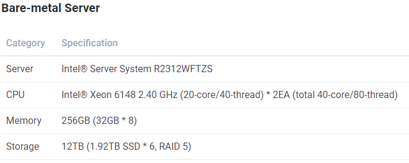
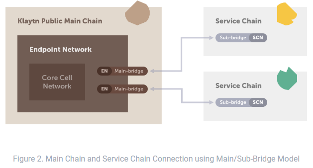

# Klaytn

2019 한국전자통신연구원
하계연수생 김승수
nablekim94@gmail.com
(2019년 08월 23일 작성)

>## Index
[TOC]

## Introduction

### Klaytn이란
- 카카오 자회사인 그라운드 X가 개발한 블록체인 플랫폼
cf. 그라운드 X : 카카오의 블록체인 연구개발(R&D) 담당 계열사

### 현재 상황
- 2018년 9월 13일, 업비트 개발자 컨퍼런스(UDC) 행사에서 클레이튼 발표
- 2019년 6월 말, 클레이튼 메인넷(Cypress) 공개

### 클레이튼 개발자 커뮤니티
- facebook
https://www.facebook.com/groups/klaytndevelopers/

- Reddit
https://www.reddit.com/r/klaytn/

### 클레이튼의 장점
- 블록 생성시간 1초
- 초당 트랜잭션 3000개 이상
- 저렴한 트랜잭션 비용
- 확장성과 프라이버시를 생각해서 서비스 체인이란 걸 구성할 수 있음
- 솔리디티, 트러플 프레임워크를 지원하여 개발자들의 진입장벽을 낮춤

    

## 기존 블록체인 플랫폼의 문제점

### 1. Scalability
- 비트코인과 이더리움이 갖는 대표적인 문제로 TPS와 Block Interval을 가지고 이야기 함ㄹ

#### TPS란?
- 초당 몇개의 거래(transaction)를 처리할 수 있는가
- 주로 Visa랑 비교를 함

|구분|거래 처리량/초|
|----|----------|
|Visa|1700/s|
|비트코인|7/s(실질적 2~5개)|
|이더리움|15~20/s|

#### Block Interval란?
- 블록 생성 간격
- 비트코인 10분, 이더리움 15~20초

***cf. 이더리움의 경우 한 블록에 들어가는 트랜잭션의 수 : 20개 X 15초=300개***

#### 왜 기존의 블록체인은 느린가?
- 참여하는 노드가 많다고 해서 빨라지는게 아님
- 100개의 일이 들어오면 100개를 분산하지 않고 모든 노드가 똑같은 일을 반복
- 전체 네트워크의 성능이 **가장 느린 노드에 맞게 하향 평준화됨**
- 따라서, 비트코인과 이더리움은 **많은 양의 트랜잭션을 처리하기 어렵고 네트워크 속도가 느린 문제를** 갖고 있음

  

### 2. Finality(최종성)

#### Finality란?
- 트랜잭션이 변경 불가라는 합리적인 보장을 받기까지 기다려야하는 시간을 말함

#### '블록이 Final하다'
- 블록에 담긴 거래가 바뀔 수 없다고 보증할 수 있다

#### 비트코인과 이더리움의 Finality
- 트랜잭션이 모호하지않고 완료되었다고 믿어야하는데 비트코인과 이더리움은 Finality이 길다.
  - ex) 비트코인으로 비행기 티켓을 샀다?
    - 기록에 남을 수 있는 거래가 생성됨. 그러나, 이 트랜잭션은 바로 처리되지 않음. **'완벽한 보증은 아니지만 결국엔 처리 될 것이다'라는 확률론적 최종성** 만 제공. 즉, 결제는 했지만 나중에 보면 결제가 안되어 있을 수도 있음
- 비트코인은 finality까지 평균 시간 60분(6번의 검증 단계를 거침), 이더리움은 6분(25번의 검증 단계를 거침)이 걸림
  - ***cf. 검증 단계 : 거래 내용이 신뢰하기에 충분하다라고 판명나는 과정***
- Finality가 너무 오래 걸리기 때문에 현재 암호화폐가 상용화되기 어려운 것임. 과연 얼마나 많은 사람이 한 시간이나 기다려줄까!?
- Finality가 빨리 처리되는 것이 중요한 비지니스의 자산임

  

### 3. Fork

#### Fork란?
- 블록들의 연결이 두 개 이상의 분기로 분리되는 현상

#### Fork가 발생하는 이유
- P2P 네트워크의 모든 참여자들이 독립적으로 채굴이 가능하므로 비슷한 시간에 채굴 완료하는 경우가 생김

#### Fork가 발생했을 때, 어떻게 하나의 체인을 유지?
- 기존 블록체인은 분기 시, **Longest Chain Rule** 을 적용

#### Longest Chain Rule이란?
- 분기가 일어났을 때, 블록들이 가장 길게 연결되어 있는 경우를 올바른 체인으로 선정하는 규칙
- 이는 악용의 가능성이 있음.
ex) 51%이상의 컴퓨팅 자원을 갖는 노드가 악의적으로 자기한테 불리한 tx를 블록에 포함시키지 않은 채로 빠르게 채굴해나가고 전파는 안한다면!? 남들보다 채굴속도가 빠르니 긴 체인을 만들 수 있고 모았다가 전파해버리면 악의적으로 만들어진 블록들이 합법적으로 받아들여짐. 또한, 분기 시 긴 체인을 선택해야하는 문제 때문에 Finality가 오래 걸리는 문제도 있음

    

## Klaytn 이해하기

### 1. Klaytn 네트워크 구조

#### Klaytn 네트워크는 어떻게 이루어져 있을까?
- Core Cell Network(CCN)와 이를 둘러싸고 있는 Endpoint Node Network(ENN)로 구성 + Service Chain Network(SCN)
- Core Cell Network는 **합의를 담당할 노드들이 있는 CNN**과 **생성한 블록을 Endpoint 네트워크에 전달하는 PNN** 으로 구성

##### Core Cell
- 하나의 Core cell은 한 개의 CN과 여러 개의 PN(Proxy Node)로 연결되어 있으며 CN에 의해 직접 운영됨
- [Official Docs][1]

  *cf. 왜 EN과 CN사이에 PN을 둘까? 바로 EN과 PN을 직접 연결하며 안되는가?
  CN은 합의를 담당하는 노드들이기에 Connection으로 인해 성능의 걸림돌이 되면 안됨.
  따라서, PN을 중간에 둠으로써 CN을 보호하며 PN을 여러대 둠으로써 확장성 문제를 해결할 수 있음*

##### CNN(Consensus Node Network)
- CNN은 CN(Consensus Node)끼리 빠른 블록 생성을 위해 서로 직접적으로 연결되어 있으며 외부 네트워크와는 제한적으로 소통이 가능하도록 한 Private 환경임.
(CN은 Core Cell 운영자로서 자신이 믿을 수 있는 PN을 앞에 내세워 CN에 접근할 수 있도록 함)

  *cf. CN, PN HW Spec*
  

###### PNN(Proxy Node Network)
- PN들이 서로 연결되어 PNN을 이룸
- 생성한 블록을 Endpoint 네트워크에 전달하는 역할
- 같은 Core Cell 내의 PNs들은 서로 연결되지 않음

##### ENN(Endpoint Node Network)
- EN(Endpoint Node)들은 PN과 연결해서 정보를 주고 받을 수 있음
- EN가 되기 위한 조건은 없음
- 서비스 제공자로서 역할 수행
  - Transaction을 생성
  - RPC API request를 처리
  - 서비스체인으로 부터 온 데이터 요청을 처리함

##### 부트노드(Bootnode)
- 새로운 노드가 네트워크에 등록하고 다른 노드에 연결할 수 있도록 돕는 특수한 노드
- 클레이튼에서 운영되는 특수한 노드임
- CN Bootnode, PN Bootnode, EN Bootnode가 있음
  - CN Bootnode는 비공개, PN Bootnode와 EN Bootnode는 공개
  - PN Bootnode : 허용된 PN만 등록할 수 있도록 해주고 EN와 연결할 수 있도록 도움
  - EN Bootnode : 어떠한 PN에 연결해야할지 EN에게 정보 제공

#### 서비스 체인(Service Chain)

##### 서비스 체인이란?
- 확장성에 기반하여 나온 아이디어로 메인넷과 연결되어 독립적으로 운영되는 블록체인
- 메인넷과 서비스 체인 사이의 소통은 자유로운 것이 아닌 제한된 트랜잭션만 사용 가능
  (Klay 전송도 추후 제약조건이 존재할 때 허용될 예정)
- 서비스 체인 안에서 트랜잭션 가스 비용을 아예 안받도록 설정하는 등 개발자가 원하는 환경을 구축하여 서비스를 제공할 수 있음
- ENN과 연결하여 Klaytn 네트워크에서 필요한 데이터를 가져올 수 있음
- *타 블록체인 플랫폼에서도 성능 문제로 채택하려는 움직임이 있음*
 *ex) 이더리움의 경우,  **용량과 속도면에서 메인넷의 한계를 겪었음.** 그래서 '플라즈마'라는 사이드 체인 기반 기술 개념을 내놓아 초당 처리되는 트랜잭션을 늘리려고 함. 아직 어떻게 될지 모름*

##### 어느 상황에 쓰는가?
- BApp이 특별한 노드환경에서 세팅되어야할 경우
- 보안 수준을 맞춤형으로 설정하여 운영하고 싶은 경우 == 프라이빗 블록체인
- 많은 처리량을 요구해서 메인넷에 배포 시 경제성이 낮다고 판단되는 경우

  *cf. Docs : Service chains in Klaytn are auxiliary blockchains independent from the Klaytn main chain, <U>tailored for individual BApp requiring special node configurations, customized security levels, or exceptionally high throughput that makes deploying the BApp on the main chain inconvenient or economically infeasible.</U>*

##### 서비스 체인을 위한 토큰 표준
- 메인넷과 서비스 체인 간의 Value transfer을 지원하기 위해 특별한 종류의 컨트랙트가 **개발될 예정**

  

### 2. Klaytn의 합의 알고리즘

#### Kyaytn의 지향점
- 강력한 보안 및 투명성을 유지하면서 엔터프라이 급 성능 및 안정성을 제공하는 퍼블릭 블록체인을 지향하고 있음
- BFT의 성능 이점을 살려서 public blockchain의 장점과 결합할 수 있다는 믿음을 토대로 **IBFT를 합의 알고리즘으로 선택**
- 공개를 통한 합의 신뢰 모델을 채택하고 있음
- 합의를 달성하는 소수의 Private 노드들과 바깥에서 블록 생성 결과를 접근 및 검증할 수 있는 노드들로 구성됨

***cf. BFT(비잔티움 결함 허용)
참여 노드 수를 제한하여 분산화와 투명성을 약화시키는 대신 성능을 높이는 알고리즘. Private Blockchain에서 많이 사용***

#### IBFT(이스탄불 비잔티움 결함 허용) 합의 알고리즘

- IBFT 합의 알고리즘은 그림과 같이 5단계로 구성됨

1. Propose 단계
    - 라운드 로빈 방식에 따라 매 라운드 마다 합의 노드들 중에 한 노드를 Proposer(제안자) 뽑음
    - 나머지 노드들은 Validator(검증자, 위원회)가 됨

2. Pre-prepare 단계
    - Proposer 노드가 블록을 생성해서 다른 노드들에게 제안

3. Prepare 단계
    - 검증자 노드들이 Proposer로부터 메세지를 받으면 자신을 제외한 다른 노드들에게 '잘 받았다'는 메세지를 보냄
    - Prepare 단계가 끝나면 시스템에서 몇 개의 노드가 살아있음을 확인할 수 있음

4. Commit 단계
    - Proposer한테 받은 블록을 받아들일건지 다른 노드들과 소통하며 결정하는 단계
    - 2/3이상이 합의했다면 받은 블록 승인함
    - tx가 변경 불가능한 상태인 finality가 이 단계에서 끝남. 이는 **합의 노드들끼리 통신을 통해 합의를 이끌어내고 그 즉시 완결성을 가짐을 의미함.** 합의 노드가 많아질 수록 통신량 많아진다는 단점도 존재하는데 합의 노드의 일부만 뽑아서 BFT를 유지하도록 되어있음.
    (비트코인이나 이더리움의 PoW 방식처럼 finality가 애매모한 상황이 아님)

5. reply
    - 합의하여 새로 생성된 블록을 주위 노드들에 전파

  

### 3. Klaytn의 블록 생성 및 전파 방법

#### 블록 생성 사이클
- 블록생성 주기를 **라운드(Round)** 라고 함
- 새로운 블록을 생성하고 끝나는 즉시 새로운 라운드가 시작됨
- 블록 생성 간격은 1초

##### 1) 제안자와 위원회 선택
- 각 라운드에서 합의 노드(블록을 생성할 제안자 + 생성한 블록을 검증할 위원회 노드)들을 <U>무작위이지만 결정적으로 뽑음</U>

  ***cf. 무작위이지만 결정적으로 뽑는다는 말의 의미
  합의 노드들은 가장 최근 블록의 헤더에 기반한 난수를 기반으로 선택이 됨***

- 자신이 그 라운드에서 제안자로 뽑히게 되면 제안자로 뽑힌 증거를 다른 합의 노드에게 알림 (제안자의 공개키를 통해 입증 가능한 암호 증명을 사용)

- 위원회가 된 노드들도 제안자에게 왜 자신이 위원회로 뽑혔는지 증거와 함께 알림

##### 2) 블록 생성
- 누가 제안자고 누가 위원회인지 결정이 되면, 제안자가 트랜잭션 풀에서 트랜잭션을 선택하여 정렬해서 블록을 만들게 됨

- 새로 만든 블록을 위원회와 새로 생성된 블록에 동의하는 합의 과정을 거쳐 마무리 지음

##### 3) 블록 전파
- 제안된 블록은 성공적으로 완료되기 위해 위원회 멤버 2/3 이상의 서명을 받아야함

- 위원회가 합의에 이르게 되면 새로운 블록이 모든 합의노드들에게 전달되고 합의 Round가 종료됨

- 새 블록이 모든 합의 노드들에게 전달되면 PN을 통해 EN들에게 전달 됨

  ***cf. 네트워크 혼잡 문제를 해결하기 위한 멀티 채널 접근 방식
  블록과 Transaction을 위한 독립된 전파 Channel들을 할당함으로써 네트워크 트래픽 혼잡 상황에도 End-User의 Request를 적절한 시간에 처리하도록 설계함***

  

#####  Block Rewards
- 매 Round마다 보상금(트랜잭션 수수료와 새로 발행된 KLAY를 합친 9.6 KLAY)은 사전 설정된 분배 비율에 따라 분배됨
- 위원회 노드는 아무런 보상을 못 받고 제안자 노드만 보상을 받음
- 제안자로 선택받을 확률은 CN의 KLAY 지분에 영향을 받음(비례)

  

### 4. Klaytn Governance Council (KGC)

#### KGC가 무엇인가?
- Klaytn 노드를 운영하고 Klaytn 개발을 위한 의사 결정에 참여하는 조직
- 클레이튼 네트워크의 실제 운영자
- KGC는 클레이튼에서 믿을 수 있는 아시아 기업들로 구성됨
- 클레이튼 메인넷 출시 시점에 18개 기업으로 시작하여 현재 논의중인 기업이 합류하여 약 30개로 확장될 예정
- 메인넷 이후 네트워크 안정성 확보 후 합의 알고리즘에 문제가 없다면 KGC 회원을 추가할 예정

#### KGC의 역할
  1. Core Cell Operator로서 합의에 참여하는 Node 구성 및 운영
  2. 클레이튼 개발 및 운영에 있어서 결정에 참여

#### KGC가 얻는 이익
  - 클레이튼 노드를 운영함으로써 블록 생성에 대한 보상을 받음. 보유한 클레이 지분에 따라 블록 생산자로 선택될 가능성이 높지만, 지니 계수(Gini Coefficient)를 적용하여 독점을 방지함
  *cf. 지니 계수
    한 국가 가계소득의 계층별 분배 상태를 측정하는 계수
    이 값이 커질수록 소득분배 불평등이 심화되는 것으로 이해*

#### KGC만 Core Cell 이룰 수 있는 것인가?
- 클레이튼 메인넷 출시 후 2년 동안은 제한된 기업들에게 KGC 멤버의 기회가 주어질 것임
- 2년 후인 2021년에는 클레이튼이 초대한 기업이 아닌 클레이튼 기반 서비스 제공자 중에 기여도가 높은 사람에게 기회가 부여될 것임. 이는 전적으로 데이터와 알고리즘으로 처리될 예정

  

#### KGC 구성원
- [기사글 발췌][3]
*cf. 클레이튼 플랫폼을 함께 운영할 '거버넌스 카운슬(Governance Council)'에는 IT, 통신, 콘텐츠, 게임, 금융 등 각 산업을 대표하는 20여개의 글로벌 기업이 참여했다. 클레이튼 거버넌스 카운슬은 클레이튼의 기술, 사업 등에 대한 주요 의사결정과 클레이튼의 '합의 노드(Consensus Node)' 운영을 담당하게 된다. 플랫폼 운영을 넘어서 클레이튼 기반 신규 서비스를 개발하거나 기존 사업에 블록체인 기술을 접목시키는 것도 논의 중이다.  
국내 대표 기업으로는 ▲LG전자 ▲LG상사 ▲셀트리온 ▲넷마블 ▲위메이드 ▲펍지 ▲펄어비스 ▲네오위즈 ▲퓨쳐스트림네트웍스(FSN) 등이 포함됐다. 카카오는 물론이고 카카오페이, 카카오페이지, 카카오게임즈, 카카오IX 등 카카오 공동체도 참여한다. 아시아권에서는 ▲필리핀 유니온뱅크 ▲악시아타 그룹 ▲해쉬키 ▲에버리치 ▲하이(hi) ▲코코네 ▲구미 등이 거버넌스 카운슬에 이름을 올렸다.*

#### 클레이튼 서비스 파트너
- ISP(Initial Service Partner) : 메인넷 공개 후 3~6개월 안에 출시할 수 있는 서비스
- 전 세계 13개국에 걸쳐 약 40개의 서비스 파트너가 확보된 상황. 이 중 1/3이 한국 이외의 지역 서비스
- 게임, 엔터테인먼트, 건강 관리, 금융, 상업, 지불 및 라이프 스타일과 같은 다양한 분야에 걸쳐 있음

  

### 5. Smart Contract Language
- Solidity v0.4.24와 v0.5.6 버전 지원
- 다른 언어를 추후 개발할 계획
- Remix와 Truffle와 같은 개발 도구를 사용할 수 있음

    

##  이더리움과 Klaytn의 차이
- 이더리움은 단일 네트워크로 모든 노드가 블록을 생성할 수 있음. 반면에, Klaytn은 Core Cell Network와 Endpoint Network라는 두 가지 layer의 네트워크로 구성되어 있으며 Core Cell을 이루는 합의 노드들이 블록 생성을 담당함.
- 클레이튼 기반 BApp의 서버는 Core Cell 옆에 있는 Endpoint Node와 연결하여 블록체인과 소통할 수 있음
- Klaytn는 메인넷과 부분적 연결된 서비스 체인을 구성할 수 있음

### Role-based Accounts : 역할 기반 계정

### Fee Delegation(트랜잭션 수수료 위임)
- Klaytn provides a number of fee-delegated versions for its basic transaction types.
- enable service providers to subsidize(보조금을 지급하다) their end-user activities by paying for their transaction fees instead.
- Ratio 변수를 사용해서 트랜잭션 수수료의 비율을 지정할 수 있음.
- 트랜잭션 발신자와 수수료 지불자의 서명을 받아야 함
- 트랜잭션 발신자가 아닌 제 3자가 수수료를 내게 하려면, 트랜잭션 발신자 A가 먼저 서명을 해서 rawTransaction 객체를 만들고 이를 수수료 납부자 계정 B으로 다시 트랜잭션을 보내는 방식
- [예시][2]

    

## Klaytn Tools
### 1. Klaytn Wallet
- Klaytn 위에서 생성된 토큰들의 안전한 보관, 전송을 지원하는 지갑
- Klay 및 Klay 호환 토큰의 잔액 확인 가능
- 계정 생성 가능
- https://baobab.klaytnwallet.com/

### 2. Klaytn IDE
- Ethereum 기반 스마트 컨트랙트 개발 IDE와 거의 비슷
- http://ide.klaytn.com/

### 3. Klaytn Scope
- 블록 생성, 거래 정보 등 클레이튼 플랫폼에서 일어나는 모든 활동을 모니터링할 수 있음
- https://baobab.scope.klaytn.com/

### 4. caver-js
- A JSON RPC framework for the Klaytn network
(equivalent to web3.js in Ethereum).

### 5.Truffle
- is used to compile and deploy smart contracts written in Solidity.
- Currently, Klaytn supports Truffle version 4.1.15.

### 6. vvisp (optional)
- is an easy-to-use cli tool/framework for developing smart contracts
- can easily set environment, deploy and execute Klaytn smart contracts with a single-command.

### etc.
- 클레이튼 화폐 단위 확인 : https://docs.klaytn.com/klaytn/design/computation/exec_model

- PEB 변환 : https://blockchains.tools/pebConverter?l=KLAY

[1]:https://docs.klaytn.com/node/cc/hw
[2]:https://docs.klaytn.com/tutorials/feedelegated
[3]:http://biz.newdaily.co.kr/site/data/html/2019/06/27/2019062700232.html
